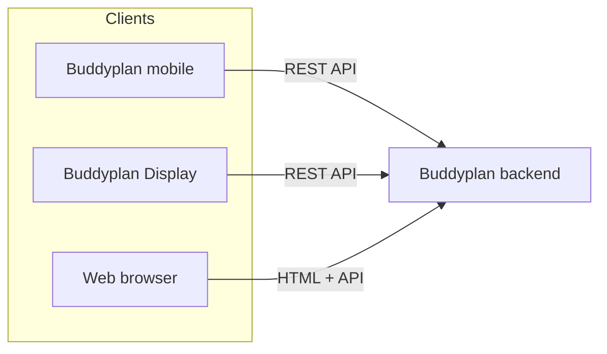

# Buddyplan

Self-hosted family todo and agenda platform: a web admin backend, a mobile app, and a wall-mounted display app for shared household planning.

- Website: [buddyplan.nl](https://buddyplan.nl)
- License: [GNU AGPLv3](LICENSE)
- Documentation: [`docs/`](docs/)
- Security: [SECURITY.md](SECURITY.md)

## Components

| Component | Path | Stack |
|-----------|------|-------|
| Backend (web + API) | [`backend/`](backend/) | Python, FastAPI, SQLite, Docker |
| Mobile app | [`mobile_app/`](mobile_app/) | Flutter |
| Wall display | [`dashboard_app/`](dashboard_app/) | Android (Kotlin) |



## Quick start (production)

### 1. Configure secrets

```bash
cd backend
cp .env.example .env
```

Generate secrets and add them to `.env`:

```bash
python -c "import secrets; print('SESSION_SECRET_KEY=' + secrets.token_hex(32))"
python -c "import secrets; print('TOKEN_PEPPER=' + secrets.token_hex(32))"
```

`SESSION_SECRET_KEY` secures web sessions. `TOKEN_PEPPER` is used to hash mobile/display API tokens at rest.

### 2. Start with Docker

```bash
cd backend
docker compose up --build
```

Open `http://localhost:8000`. On first run you are redirected to `/setup` to create the admin account.

Alternatively, set `BUDDYPLAN_ADMIN_USERNAME`, `BUDDYPLAN_ADMIN_PASSWORD`, and optionally `BUDDYPLAN_ADMIN_NAME` in `.env` to skip the setup page.

### Install from GHCR (recommended for servers)

Pre-built backend images are published to [GitHub Container Registry](https://docs.github.com/en/packages/working-with-a-github-packages-registry/working-with-the-container-registry) (GHCR) when a [GitHub Release](https://github.com/dennisyakkz/buddyplan/releases) is published. Use this on a NAS, VPS, or any host where you do not want to build the image locally.

**Image:** `ghcr.io/dennisyakkz/buddyplan-backend:<version>` (e.g. `0.7.0`)

On the server:

```bash
mkdir -p ~/buddyplan && cd ~/buddyplan

curl -fsSLO https://raw.githubusercontent.com/dennisyakkz/buddyplan/main/backend/docker-compose.prod.yml
curl -fsSLO https://raw.githubusercontent.com/dennisyakkz/buddyplan/main/backend/.env.example
cp .env.example .env
```

Generate secrets and add them to `.env` (see step 1 above). Then pin the release version and start:

```bash
export GHCR_OWNER=dennisyakkz
export BUDDYPLAN_VERSION=0.7.0

docker compose -f docker-compose.prod.yml pull
docker compose -f docker-compose.prod.yml up -d
```

Open `http://<server-ip>:8000`. Data is stored in the `buddyplan-data` Docker volume (`/data/buddyplan.db` inside the container).

You can also set `GHCR_OWNER` and `BUDDYPLAN_VERSION` in a `.env` file next to `docker-compose.prod.yml` (Compose reads them for image substitution). Pin a specific version for production; avoid `latest` on long-running installs.

After the first publish, make the package **public** under GitHub → **Packages** → **buddyplan-backend** → **Package settings** → **Change visibility**, so pulls work without `docker login`.

More detail: [docs/releases.md](docs/releases.md) (upgrades, OMV, troubleshooting).

### 3. Install apps

Build the Android apps (see below), install them on your devices, and configure the server URL in each app's settings.

| App | Android package ID |
|-----|-------------------|
| Buddyplan (mobile) | `nl.buddyplan.mobile` |
| Buddyplan Display (wall tablet) | `nl.buddyplan.display` |

**Package rename:** If you previously installed apps under the old `com.fiona.*` package IDs, you must install the new builds as **separate apps** (not an in-place upgrade). Local prefs and cache from the old packages are not migrated. Re-enter the server URL in app settings after installing.

When publishing this repository on GitHub, you may optionally rename the local checkout folder from `fiona-todo` to `buddyplan` (outside the code diff).

## Environment variables

| Variable | Required | Description |
|----------|----------|-------------|
| `SESSION_SECRET_KEY` | Yes (production) | Secret for signing web session cookies |
| `TOKEN_PEPPER` | Yes (production) | Secret for HMAC hashing of API tokens |
| `BUDDYPLAN_DEV` | No | Set to `1` for local dev without required secrets |
| `DATABASE_PATH` | No | SQLite path (default: `buddyplan.db` in data dir) |
| `TZ` | No | Timezone (default: `Europe/Amsterdam`) |
| `BUDDYPLAN_ADMIN_USERNAME` | No | Bootstrap admin username (skips `/setup`) |
| `BUDDYPLAN_ADMIN_PASSWORD` | No | Bootstrap admin password |
| `BUDDYPLAN_ADMIN_NAME` | No | Bootstrap admin display name (default: `Admin`) |

See [`backend/.env.example`](backend/.env.example) for a template.

## Development

### Backend

```bash
cd backend
python -m venv .venv
source .venv/bin/activate
pip install -r requirements.txt
cp .env.example .env
# Set BUDDYPLAN_DEV=1 in .env for local development without production secrets
uvicorn app.main:app --reload --port 8000
```

### Mobile app

Requires Flutter SDK 3.x.

```bash
cd mobile_app
flutter pub get
flutter run
```

Release APK:

```bash
flutter build apk --release
# Output: build/app/outputs/flutter-apk/app-release.apk
```

### Wall display app

Requires Android SDK and JDK 17+.

```bash
cd dashboard_app
./gradlew assembleRelease
# Output: app/build/outputs/apk/release/app-release.apk
```

Release builds of the display app currently use the Android debug keystore for convenience. For production distribution, configure your own signing keystore in `dashboard_app/app/build.gradle.kts`.

Do not commit built APK files; distribute them via your own release channel.

## Optional: Afvalwijzer (Netherlands)

Buddyplan includes an optional integration with Dutch household waste collection schedules via [mijnafvalwijzer.nl](https://www.mijnafvalwijzer.nl). Enable it in the web admin under **Persoonlijk → Afvalwijzer** to sync pickup dates and auto-create "buitenzetten" / "binnenzetten" tasks for family members.

This module is Netherlands-specific and not required for core todo/agenda use. See [docs/afvalwijzer.md](docs/afvalwijzer.md) for setup details.

## License

Buddyplan is licensed under the **GNU Affero General Public License v3.0 (AGPL-3.0)**.

If you run a modified version of this software as a network service, you must make the corresponding source code available to users of that service, as required by the AGPL.

See [LICENSE](LICENSE) for the full license text.
