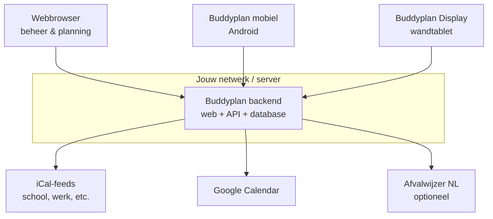

# Buddyplan — functionele beschrijving

Buddyplan is een **self-hosted gezinsplatform** voor gedeelde planning: taken, agenda's en overzichten op één centrale server die je zelf beheert. Het bestaat uit drie onderdelen die samenwerken via één backend:

| Onderdeel | Doel |
|-----------|------|
| **Webbeheer** | Instellen, beheren en plannen via de browser |
| **Buddyplan (mobiel)** | Agenda en taken op je telefoon, ook offline |
| **Buddyplan Display (tablet)** | Wanddisplay in huis: altijd zichtbaar overzicht |

De interface is in het **Nederlands**, met Nederlandse datum/tijdweergave (`Europe/Amsterdam`).

---

## Het probleem dat Buddyplan oplost

Gezinnen jongleren met schoolroosters, werkagenda's, huishoudelijke taken en losse apps. Buddyplan brengt dat samen op **jouw eigen server** (thuis-NAS, Raspberry Pi, VPS): één plek waar iedereen zijn taken en afspraken ziet, afvinkt en — waar nodig — beheert. Geen abonnement op een cloud-dienst; jij bepaalt waar de data staat.

---

## Architectuur in het kort

Alle clients praten met dezelfde backend. Agenda-items uit externe bronnen (iCal, Google) worden op de server ingelezen en verschijnen daarna overal: web, mobiel en display.

---

## Gezinsleden en rollen

Buddyplan werkt met **personen** (gezinsleden). Iedereen kan een eigen agenda hebben. Optioneel kan iemand **inloggen** (web, mobiel of display).

| Rol | Wie | Wat |
|-----|-----|-----|
| **Beheerder** | Eerste account via setup | Gebruikers aanmaken, integraties, rechten, display-updates |
| **Gezinslid** | Persoon met login | Eigen profiel, agenda/taken waar je rechten voor hebt |
| **Display** | Tablet aan de muur | Ingelogd als gezinslid; vooral bekijken en afvinken |

**Rechten zijn granulair:**

- **Agenda:** per persoon instelbaar wie diens agenda mag beheren (standaard: jezelf).
- **Taken:** per persoon optioneel een takensysteem; instelbaar wie taken mag aanmaken, bewerken en afvinken.

Zo kan een ouder de agenda van een kind beheren, terwijl een volwassene alleen de eigen planning beheert.

---

## Taken

Het takensysteem is geschikt voor **dagelijkse en terugkerende taken** (tanden poetsen, afval buiten zetten, huiswerk, etc.).

### Wat je kunt doen

- Taken **aanmaken** met titel, beschrijving, datum en **icoon** (visueel herkenbaar, ook voor kinderen).
- **Herhaling:** eenmalig, dagelijks, wekelijks, tweewekelijks, of op vaste weekdagen; optioneel met einddatum.
- Taken **afvinken** ("ik heb het gedaan") — op web, mobiel en wanddisplay.
- Taken **slepen** in de webinterface (andere dag of volgorde binnen een dag).
- Per gebruiker instellen of het takensysteem aan staat en wie het mag beheren.

### Waar

| Client | Taken bekijken | Afvinken | Aanmaken/bewerken |
|--------|----------------|----------|-------------------|
| Web | ✓ (dag/week/maand) | ✓ | ✓ (met rechten) |
| Mobiel | ✓ (dag/week) | ✓ | ✓ (met rechten) |
| Display | ✓ (vandaag) | ✓ | — |

Op de **wanddisplay** zie je vooral **taken van vandaag** — bedoeld om snel af te vinken zonder de telefoon te pakken.

---

## Agenda

Iedereen in het gezin kan een **eigen agenda** hebben. Items kunnen handmatig zijn of automatisch uit externe bronnen komen.

### Handmatige afspraken

- Aanmaken, bewerken en verwijderen (met de juiste rechten).
- **Herhaling** zoals bij taken.
- Op **mobiel** ook **start- en eindtijd**; op web vooral datum-gebaseerd.

### Weergaven

| Client | Weergaven |
|--------|-----------|
| Web | Dag, week, maand; dashboard met weekoverzicht per persoon |
| Mobiel | Planning (lijst), dag, week, maand |
| Display | Weekrooster per persoon; tik op een dag voor dagdetail met klok bij getimede events |

Agenda-items hebben een **kleur per persoon**, instelbaar per client (zichtbaarheid en kleur in mobiel- en display-instellingen).

### Externe agenda's (alleen via server)

De backend kan agenda's **importeren**; clients tonen de resultaten.

**iCal-feeds** (HTTPS/WEBCAL-URL):

- Schoolrooster (bijv. rooster.nl), werk, sportclub, etc.
- Per feed: label, sync-interval (15 min / 1 uur / 1 dag), prefix, kleur, tijden tonen/verbergen.
- Automatische achtergrondsync (standaard elke 5 minuten gecontroleerd; interval per feed).

**Google Calendar:**

- OAuth-koppeling per gebruiker (admin configureert Client ID/Secret eenmalig).
- Kiezen welke Google-agenda's je importeert.
- **Kleurfilters** (bijv. alleen "Lavendel"-events) om ruis te verminderen.
- Automatische sync (ongeveer elke 10 minuten).

Items uit iCal of Google zijn **alleen-lezen** in Buddyplan — wijzigingen doe je in de bronagenda of je beheert handmatige items apart.

---

## Webbeheer (browser)

Het web is het **centrale bedieningspaneel** voor setup en beheer.

### Eerste start

- Geen vooraf ingevuld gezin of wachtwoord.
- Bij eerste bezoek: **setup-wizard** voor het beheerdersaccount.
- Daarna: personen toevoegen, rechten instellen, apps koppelen.

### Pagina's voor iedereen (ingelogd)

- **Dashboard** — weekkalender van het gezin + eigen taken van vandaag afvinken.
- **Taken** — volledig takenbeheer (met rechten).
- **Agenda** — volledig agendabeheer (met rechten).
- **Profiel** — naam, e-mail, wachtwoord; eigen iCal/Google-koppelingen; ingelogde apparaten intrekken.

### Alleen beheerder

- **Gebruikers** — aanmaken, bewerken, login/admin-rechten, agenda-/taak-managers per persoon.
- **Google Calendar API** — OAuth-credentials voor het gezin.
- **Upgrades** — nieuwe **display-APK** uploaden voor wandtablets.
- **Afvalwijzer** — optionele NL-module (zie hieronder).

---

## Buddyplan mobiel (Android)

De mobiele app is bedoeld voor **onderweg**: agenda en taken in de zak, met **offline-ondersteuning**.

### Instellingen & login

- Server-URL instellen (jouw thuisserver of NAS).
- Inloggen met gezinsaccount.
- Per persoon: zichtbaarheid en kleur voor agenda en taken.

### Offline

- **Lezen uit lokale cache** als er geen verbinding is.
- **Aanmaken** van taken/agenda-items en **afvinken** worden in een wachtrij gezet en gesynchroniseerd zodra er weer netwerk is.
- Bewerken/verwijderen van bestaande items vereist meestal een actieve verbinding.

### Gebruikservaring

- Nederlandse interface.
- Pull-to-refresh en automatische verversing.
- Melding bij verlopen sessie (opnieuw inloggen).

---

## Buddyplan Display (wandtablet)

De display-app draait op een **Android-tablet aan de muur** — keuken, gang, hobbykamer.

### Wat het doet

- **Altijd zichtbaar** weekoverzicht: wie heeft wanneer wat op de agenda.
- **Taken van vandaag** per gezinslid (met icoon en kleur).
- **Afvinken** met één tik (overlay "Klaar").
- **Dagdetail** met analoge klok bij afspraken met tijd.
- **Offline:** laatst bekende data blijft zichtbaar; sync zodra de server bereikbaar is.

### Extra tabletfuncties

- **Donkere modus**
- Optionele **PIN** voor instellingen
- **Launcher-modus** — tablet als startscherm
- **App-launcher** — andere geïnstalleerde apps starten (mini-kiosk)
- **OTA-updates** — nieuwe display-versie ophalen vanaf je eigen server (admin uploadt APK)

De display is **geen** volwaardig beheerscherm: geen agenda/taken aanmaken, wel het gezins-overzicht en snel afvinken.

---

## Optioneel: Afvalwijzer (Nederland)

Specifiek voor Nederlandse adressen die op [mijnafvalwijzer.nl](https://www.mijnafvalwijzer.nl) staan.

- Postcode en huisnummer invoeren → ophaalschema ophalen.
- Per afvalstroom instellen wie **buiten zet** en **binnen haalt**, en wanneer (dag ervoor / zelfde dag / dag erna).
- Taken verschijnen in het normale takensysteem (web, mobiel, display).
- Handmatig "taken nu aanmaken" of **automatisch elke zondag om 02:00** voor de komende week.

Niet verplicht; de rest van Buddyplan werkt zonder deze module. Zie [afvalwijzer.md](afvalwijzer.md) voor technische setup.

---

## Synchronisatie en betrouwbaarheid

| Wat | Hoe |
|-----|-----|
| iCal-feeds | Periodiek ophalen; caching tegen overbelasting |
| Google Calendar | Periodieke sync met tokens veilig op de server |
| Mobiel ↔ server | REST API; lokale SQLite-cache |
| Display ↔ server | Periodische sync (~1 min); lokale cache voor offline |
| Apparaatsessies | Per device inloggen; sessies intrekken via profiel/admin |

Bij een schone installatie moeten mobiel en display **eenmalig** de server-URL en login instellen. Data staat op **jouw** server, niet bij een externe SaaS-aanbieder.

---

## Privacy en self-hosting

- Buddyplan draait **op jouw hardware** (Docker op NAS/OMV, thuisserver, VPS).
- Geen verplichte cloud of externe accounts (behalve optioneel Google/Afvalwijzer).
- API-tokens en wachtwoorden worden server-side beveiligd opgeslagen.
- Open source onder **AGPLv3** — je kunt de code inzien en aanpassen.

Je bent zelf verantwoordelijk voor backups van de database, HTTPS via reverse proxy (bij externe toegang) en het beveiligen van secrets. Zie [SECURITY.md](../SECURITY.md).

---

## Samenvatting: wat Buddyplan wel en niet is

### Buddyplan is wél

- Een **gezinsagenda + gedeelde taken** op eigen server.
- **Drie clients** (web, mobiel, wanddisplay) op één databron.
- **iCal- en Google-import** voor bestaande agenda's.
- **Offline mobiel** en **always-on display**.
- **Flexibel rechtenmodel** per gezinslid.
- **NL-vriendelijk** (taal, tijdzone, optioneel Afvalwijzer).

### Buddyplan is geen

- Google Play / App Store SaaS met hosted backend.
- Vervanging van een volledige Google/Outlook-workflow (import is one-way read-only).
- Multi-tenant platform voor willekeurige organisaties (ontworpen voor **één gezin/huishouden** per installatie).
- Play Store-gedistribueerde app met centrale login (je bouwt/sideloadt de APK's zelf).

---

## Typische gebruiksscenario's

1. **Gezin met schoolkinderen** — schoolrooster via iCal op de server; weekoverzicht op de tablet; ouder beheert agenda van kind via web.
2. **Huishouden met vaste taken** — dagelijkse/wekelijkse taken met iconen; kinderen vinken af op de display.
3. **Werk + privé** — eigen Google-agenda importeren; privé-afspraken naast gezinstaken in één overzicht.
4. **NAS-thuisserver** — Docker op OpenMediaVault; backend via GHCR; APK's handmatig op devices installeren.

---

## Meer informatie

- [Installatie](installation.md)
- [Releases & GHCR](releases.md)
- [Root README](../README.md)
